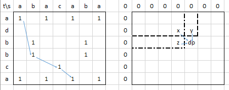

https://www.youtube.com/watch?v=e67Tba6tC1Y


Восстановление пути. Обычно массив, где для соответствующего элемента хранится его предок. 
Необязательно хранить две его координаты, например, можно, например направление откуда пришли в эту ячейку... 


## Наибольшая общая подпоследовательность

Даны две строки, найти максимально длинную подпоследовательность (т.е. не обязательно соседние буквы), 
которая есть в обеих строках  


Матрица dp. Окантуем ее нулями, как обычно - так удобнее.   
В ячейке (i, j) храним максимальную длину подпоследовательности, которую можно составить из i букв одной строки 
и j другой. Тогда (см. на рис. y и z):  
```python
dp[i][j] = max(dp[i - 1][j], dp[i][j - 1])
```
Кроме случая, когда буквы, соответствующие i и j совпадают. В этом случае можем заменить (см. на рис. x):  
```python
if s[i - 1] == t[j - 1]: # не забываем, что добавили окантовку в dp  
    dp[i][j] = max(dp[i][j], dp[i - 1][j - 1] + 1)
```
Ответ в правой нижней ячейке
Восстановление ответа. Еще один массив. Сохраняем в нем с какого направления пришли в данную ячейку: x, y или z. 
Потом будем идти из левого нижнего угла и если пришли из x, то включаем текущую ячейку в ответ, если y или z, 
то переходим туда, но не добавляем ячейку в ответ. 


## Наибольшая возрастающая последовательность

Дана последовательность arr: 3 1 2 4 6 5 3  
Массив dp длиной N+1. dp[i] - минимальное число, на которое заканчивается возрастающая подпоследовательность длины i. 
dp[0] = -бесконечность, остальные - +бесконечность.  
dp пошагово:  
| - + + + + + + +  
| - 3 + + + + + +  
| - 1 + + + + + +  
| - 1 2 + + + + +  
| - 1 2 4 + + + +  
| - 1 2 4 6 + + +  
| - 1 2 4 5 + + +  
| - 1 2 3 5 + + +  
Эдакий "стек", в который мы погружаем маленькие числа.

Начинаем обрабатывать с первого числа. Каждый раз корректируем нужные элементы в dp, находя их бинарным поиском
```c
for (int x : arr) {
    int pos = lower_band(dp.begin(), dp.end(), x);
    dp[pos] = x;
}
```

Для восстановления последовательности надо будет в dp хранить не сами числа, а их позиции? 
И сделать массив предков отдельный.


