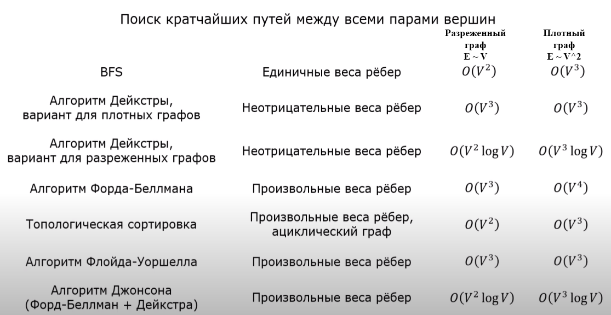

Список плейлистов, которые надо просмотреть/законспектировать:  
DFS https://www.youtube.com/watch?v=0vUqPIaUX2Q&list=PLGhUJWLZ8uQ69hYB-AtVCerJ5yqh_5awR  +  
BFS https://www.youtube.com/watch?v=4iDv8Zu8L3I&list=PLGhUJWLZ8uQ4EWdQwVyUFnz82kbeGRP97  +  
Бинарный поиск https://www.youtube.com/watch?v=q06xEZ7coR0&list=PLGhUJWLZ8uQ6imh9KFusOh2Hv_oD1619W  +  
Двоичное дерево поиска https://www.youtube.com/watch?v=8Gdp7XJeW5g&list=PLGhUJWLZ8uQ5Ewplzb1ER29p4-kQme5Yr  
Массив https://www.youtube.com/watch?v=y42rAaql_uc&list=PLGhUJWLZ8uQ4PVZ5sIyiJy8EQduBKEqRN   
Итеративный перебор https://www.youtube.com/watch?v=qCybBkuHvE4&list=PLGhUJWLZ8uQ7hXcJJ_prpXn_AaYC4pNIn  

---
## Бинарный поиск
O(logN).  
Найти заданное число в отсортированном массиве.  
Нельзя вот просто так взять и написать бинарный поиск. Подводные камни всплывают.  
Указатели l и r на крайние элементы ставим. Вычисляем центр m = (l + r) / 2. Если под ним искомое число - возвращаем c. 
Если меньшее число, то смещаем l на m + 1, а если большее: r на m - 1. Если l стало больше r - нет искомого числа. 
Но так мы нашли "любое" искомое число. Но, обычно, надо найти либо крайнее левое из таких чисел, либо крайнее правое. 
И тут могут быть подводные камни.  

### Левый бинарный поиск
Возможны разные подходы.  
Правый бинпоиск пишется симметрично.  
Цикл ведем до while l + 1 > r (пока указатели не встанут рядом). 
Если под m искомое число перемещаем r на m (вдруг и левее тоже стоит искомое число). 
l тоже строго на m смещаем. 
После окончания цикла проверяем не стоит ли под одним из указателей искомое число.  
Второй способ. Инициализируем: l = -1, m = len(lst). 
Тогда искомое число всегда будет под r, если оно есть. r указывает на первый элемент равный или больший искомого 
(может указывать и за правую границу массива - проверять это).  

### Бинарный поиск по ответу
Какого минимального размера квадратную доску надо взять, чтобы разместить на ней N дипломов размера H*W?  
Задача решается таким способом, если:  
- ответ на задачу меняется монотонно: до X все варианты не подходят, а с X все варианты подходят, либо наоборот;
- можно эффективно проверять подходит какой-то X или нет (такая инвертированная исходная задача).

Границу l инициализируем размером, который заведомо не подходит, а r - размером, который заведомо подойдет 
(конкретные значения зависят от задачи). 
Обычно создают отдельную функцию, которая возвращает True/False в ответ на вопрос: подходит ли нам ответ X. 
Запускаем левый (в этом случае: мы же ищем минимальную доску) бинарный поиск. 

### Вещественный бинарный поиск
Решить уравнение с какой-то точностью. Функция монотонная.  
Делаем бинарный поиск по ответу. Сколько раз?   
while r - l > e. Есть неочевидные проблемы. 
Если e слишком маленькая (а l - большая? /юб/), то m может все время совпадать с l. 
Получится бесконечный цикл.  
Поэтому советуют использовать for. Например, double - 64 бита. 
И тогда достаточно 64(?) итераций, чтобы достичь максимальной точности. 
Запускаем с запасом, к примеру, 100 итераций. 
Выводим l или r: они максимум отличаются в последнем бите мантиссы.  

### Тернарный поиск
Троичный поиск.  
Найти минимум функции. Функция имеет только один минимум, левая ветвь монотонно убывает, правая - монотонно возрастает. 
Впрочем, в некоторых задачах минимумом может быть плоское донышко. 
К сожалению, во многих оптимизационных задачах эти условия не выполняются. 
Тогда надо график делить на подходящие участки.  
Две точки ml и mr: первая - правее l на 1/3, правая - на 2/3. 
Если ml > mr, l = ml: выбрасываем левую треть. Иначе m = mr. 
При ml == mr можно выбросить крайние трети, но обычно не заморачиваются и выбрасывают одну. 
При определении количества итераций в for помнить, что основание логарифма у нас уже не 2, а только 1,5.  
К сожалению, если вычисление функции сложное, то быстро накапливаются погрешности и не удается достичь 
заданной точности.  
---

---

## Задачи с отрезками
Часто это задачи про расписание.  
Например, найти время, когда все кассы работают.  
Считаем отрезки. Вводим координаты в список с кортежиками: (-1, координата начала) или (1, координата конца). 
Список сортируем. И начинаем в каунтер складывать: cnt -= lst[0]. Если в т.7 один отрезок заканчивается, 
а другой начинается, то получится что в этой точке 2 отрезка. Если задача будет какой-то другой, то первые числа
в кортеже можно другие поставить.
---

## Дерево отрезков
http://e-maxx.ru/algo/segment_tree   
Например, дан массив чисел и надо для них находить минимум: стопицот запросов типа - минимум с 12 по 37-й элемент.
Строим дерево "от этого массива": сперва минимумы для пар соседних элементов, потом слой с минимумами пар пар 
(т.е. для четверок элементов). И так до общего минимума.  
Надо создать несколько функций. Для создания дерева (build), для добавления в массив новых элементов (update; 
если такое поведение в задаче есть), для извлечения ответа (get; например, ответ на отрезке l-r).
Дерево храним в массиве. Если длина исходного массива - 2^k, то длина массива дерева - 2^(k+1). Но если такая длина 
не гарантируется, то с запасом можно выделить 4*n ячеек. Корень дерева - ячейка 1 (нулевая ячейка не задействуется). 
Адреса детей ячейки m - 2*m и 2*m+1, родителя - m // 2.  
Функция build. Строим дерево рекурсивно. Начинаем с вершинки, потом идем в ее детей (2*m и 2*m+1, при этом диапазон, 
за который отвечает узел, располовинивается) и т.д. Когда доходим до листа (диапазон становится в 1 элемент), 
ставим значение из исходных данных. На обратном ходе рекурсии вычисляем значения в узлах.  
Функция get. Ответ ищем рекурсивно. Узел отвечает за элементы исходного массива [L, R]. Если [l, r] и [L, R] 
не пересекаются, то возвращаем плюс бесконечность (для задачи поиска минимума). [L, R] внутри [l, r] - значение из узла. 
Во всех остальных случаях делим отрезок пополам и вызываем рекурсивно функцию для этих подотрезков. 
Из возвращенных чисел делается ответ на обратном ходу рекурсии.  
Функция update. Движемся рекурсивно по узлам в сторону листа изменения значения. На обратном ходе пересчитываем 
значения в родительских узлах. 
---

---

## Графы

Обычно, задачи на графы формально вообще не про графы: надо еще догадаться, что здесь узлы, а что ребра
(состояния и переходы между этими состояниями). 
Например, двумерные карты с водой и островами, комнаты со стенами (лабиринты). 
Головоломка о переливании воды с двумя сосудами (массив состояний - сколько литров в каждом ведре, 
надо аккуратно описать все возможные ходы: дополнить/опустошить/перелить; перебираем состояния пока не дойдем до 
подходящего - сколько-то литров в одном из ведер).  
Массив предков для хранения на i-й позиции родителя i-й вершины.  

| Задача                                | BFS | DFS |
|:--------------------------------------|:---:|:---:|
| Поиск кратчайшего пути от a до b      |  v  |  x  |
| Проверка существования пути от a до b |  v  |  v  |
| Поиск компонент связности             |  v  |  v  |
| Поиск циклов                          |  x  |  v  |
| Проверка на двудольность              |  v  |  v  |
| Топологическая сортировка             |  x  |  v  |
| Поиск компонент сильной связности     |  x  |  v  |

Поиск циклов бфсом возможен только специфичный: для данной вершины. 
Запускаемся от нее и смотрим не появится ли в потомках эта вершина. 
Для произвольной вершины придется бфс запустить от каждой. 
Зато найдет именно минимальный цикл.  
У BFSа нет риска переполнения стека рекурсии. 

### DFS
рекурсивный DFS. Прямой обход: NLR. Бежим до левого нижнего листа, потом шаг назад и пытаемся сделать шаг правее. 
И т.д. Для шагов каждый раз вызываем рекурсивно алгоритм. Используем список смежности, ведем список уже посещенных 
вершин (это просто массив: обычно в задачах вершины задаются порядковыми номерами, и значит мы можем хранить информацию 
по соответствующему индексу массива).  
Рекурсивный вариант - классика. Простой вариант со стеком (как bfs, но вместо очереди - стек) обходит вершины 
несколько в ином порядке, что не позволяет решать некоторые задачи. 
Но можно сделать более сложный вариант, обходящий так же как и рекурсивный.  
Работает и с ориентированными и не ориентированными графами. Сложность O(V + E).  

#### Достижима ли вершина f из вершины s? 
Делаем dfs из s и смотрим отмечена ли вершина f в списке посещенных вершин.  

#### Cколько вершин можно достичь из заданной вершины? 
В массиве посещенных вершин будут отмечены только достижимые вершины.  

#### Поиск/раскраска/подсчет компонент связности
https://www.youtube.com/watch?v=rZkauRhHKGo   
Бежим циклом по вершинам в списке посещенных вершин и запускаем дфс 
от каждой еще не посещенной вершинки. В еще одном массиве отмечаем к какой из компонент связности относится 
данная вершина (для подсчета кс достаточно счетчика, конечно). Впрочем, эту информацию можно хранить и 
в списке посещенных вершин: 0, если не посетили, и номер кс в ином случае.  

#### Поиск циклов в ориентированном графе
https://www.youtube.com/watch?v=pB83tSvoBuc  
Сначала все вершины белые (нолики в списке посещенных вершин). 
При первом посещении вершины (в начале функции дфс) красим вершину в серый - 1, 
при последнем (в конце функции дфс) - в черный (2). 
Цикл - это когда мы встречаем серую вершину (мы вошли в нее, но еще не вышли).  
Для _восстановления цикла_ создаем массив для хранения на i-й позиции родителя i-й вершины. 
Как только находим цикл брэкаем всю рекурсию (а то там же происходят перезаписывания родителей). 
Остается пробежаться по массиву родителей от вершины, замкнувшей цикл до нее же. Получившийся массив реверснуть. 

#### Поиск циклов в неориентированном графе
https://www.youtube.com/watch?v=8QFS6AC0WeI  
Все так же как с ориентированным графом, только надо объяснить программе, что цикл 1-2-1 нас не устраивает.
(Разве? А не надо выкинуть окраску в черный цвет? Хотя это и не помешает, но оно не нужно). 
Поэтому передаем в функцию дфс номер родителя и не учитываем этот узел при решении вопроса о наличии цикла. 

#### Двудольность графа
https://www.youtube.com/watch?v=8QFS6AC0WeI  
Решается "жадно". 
Идем дфсом и красим вершины попеременно в 1 и 2. 
Если встречаем посещенную вершину, то проверяем, окрашена ли она в противоположный цвет (3 - цвет текущей вершины). 

#### Топологическая сортировка
https://www.youtube.com/watch?v=o0P8oNXoA_w  
DAG - ориентированный ацикличный(!) граф.  
DFS делаем и на выходе из узла (лист или обошли всех детей уже) добавляем узел в массив. Потом, перевернув этот массив, 
получаем "отсортированный" список узлов: для любой вершины из него знаем, что путь в нее шел только через вершины, 
расположенные левее нее. Все ребра в этом списке идут строго слева направо. Топологическая сортировка не единственна, 
это не помешает.  
Бывают задачи, в которых надо считать не с начала списка топсорта, а с конца.  
Задача _нахождения кратчайшего пути_ во взвешенном графе решается тогда всего за O(V + E). 
Но не забываем ограничение - только в ациклическом графе. 
~~Создаем "обратный" список смежности (осс): откуда в эту вершину можем прийти.~~ 
Внешний цикл - по вершинам топологически отсортированного, внутренний - по ~~предкам~~ потомкам выбранной 
во внешнем цикле вершины ~~(используем осс)~~. 
Пробуем прорелаксировать ребро dist[i] = min(dist[i], dist[j] + длина i-j), как в Форде-Беллмане. 
В Форде-Беллмане мы наугад тыкали все пути, а здесь, благодаря ~~осс и~~ топсорту, мы только то, что надо перебираем.  
Задача на нахождение _количества путей_ до какой-то вершинки. Тот же алгоритм. cnt[i] = сумма всех cnt[j] (количеств 
путей до родителей).  
_Нахождение компонент сильной связности_ (ксс) в ориентированном графе с циклами. 
https://www.youtube.com/watch?v=-UgiBh1IMQU 
Внутри ксс можно в конце концов попасть из каждого узла в каждый. 
Узлов в ксс может быть 1, 3 и более.  
Создаем граф, в котором все ребра направлены в противоположном направлении. 
Делаем топсорт по этому графу (конечно, неправильно так говорить, когда граф с циклами; правильно: сортировка 
по убыванию времени выхода при dfs).
Запускаем dfs на исходном графе, но в порядке топсорта, полученного на вспомогательном графе.
Находим всю ксс для первого узла, отмечаем эти вершины, как принадлежащие первой ксс, отмечаем уже посещенные вершины.  
Теперь строим ксс для следующей в топсорте вершины, которую мы еще не посетили.  

#### "Карта"
https://www.youtube.com/watch?v=waXBVBKdV1s  
Двумерная карта, где 0 - вода, 1 - суша. Или комната со стенками (лабиринт).   
Можно, конечно, создать явный граф на этой основе. Но так не делают.  
Массив посещенных вершин будет матрицей такого же размера. 
Можно вместо него использовать исходную карту. 
Надо будет обходить 4/8 соседей клетки (i, j) и лучше заранее создать список кортежей[(0, 1), (0, -1), (-1, 0), (1, 0)]. 
В C++ это будут 2 массива смещений: [0, 0, -1, 1] и [1, -1, 0, 0]. 
Внутри функции дфс отмечаем клетку посещенной и бежим по созданным кортежам и прибавляем значения из них 
к координатам текущей клетки. 
Если получившаяся соседняя клетка не выходит за границы, не посещена и является сушей, то запускаем от нее рекурсивно 
дфс.  
Если надо все _острова "раскрасить"_, то снаружи цикл по списку посещенных клеток. Если клетка не посещалась 
и является сушей, то запускаем от нее дфс. Первый остров в матрице посещенных клеток "красим" единичками, 
второй - двойками и т.д.   
Если надо только _посчитать количество островов_, то можно обойтись счетчиком.
---

### BFS
https://www.youtube.com/watch?v=4iDv8Zu8L3I  
Использование очереди - классика. 
Но, как я понял, это потому, что в других задачах на основе BFS очередь нужна. 
Сам обход можно было бы совершать просто итерируясь whileом по списку, в конец которого мы добавляем "новые" вершины.  
Создадим массив расстояний. Напротив индекса стартовой вершины - 0. В остальных сначала - плюс бесконечности. 
Кладем в очередь стартовую вершину.  
Пока очередь не пуста, извлекаем из очереди левую вершину. 
Определяем ее непосещенных соседей (у них дистанция - бесконечность; но для некоторых задач лучше условие запписать: 
текущее расстояние > расстояние до родителя + 1). 
Отмечаем соседку посещенной и записываем кратчайший путь до нее: +1 к расстоянию у родительницы.  
У вершин других компонент связности расстояние останется - бесконечность.  
Работает и с ориентированными и неориентированными графами. Сложность O(V + E).  

#### Восстановление кратчайшего пути
Как всегда: массив предков. При каждом обновлении массива расстояний обновляем и массив предков.

#### Все вершины, лежащие на кратчайших путях из A в B
Запускаем бфс из A. Пусть расстояние 4. Запускаем бфс из B. Получаем два массива расстояний.
(Такой трюк с двойным запуском можно провернуть с любым алгоритмом, находящим кратчайший путь.) 
На кратчайших путях лежат все вершины, для которых сумма расстояний в этих массивах равна 4. 
Ребро лежит на кратчайшем пути, если сумма расстояний от одной вершины до A и от другой до B равна 3.  

#### "Карта"
Смотри в dfs."Карты" более подробное описание.  
Создаем матрицу расстояний, заполняя бесконечностями, массивы смещений.  
Если _входов и выходов несколько_, найти кратчайший путь. 
Добавляем все стартовые вершины в очередь и расстояние указываем для каждой - 0. 
Потом найдем наименьшее число в ячейках выхода. 
Такой подход работает и со многими другими алгоритмами из этого раздела.  
_0-1-BFS_. Обычный ход не стоит ничего, а ход на стражника - 1 (платим ему). Сколько можем заплатить минимально? 
Если делать как обычно, нарушится главный принцип: сначала должны быть обработаны более близкие узлы и лишь после - 
дальние. 
Поэтому вместо очереди - дэк. Ячейки без стражника пушим не справа, слева. 
Если в клетке стражник, то обрабатываем как раньше, а если нет, то расстояние записываем как до родителя и пушим слева. 
У меня визуальный образ из игры сапёр: мы расширяем пространство свободных клеток, пока везде не упремся в стенки или 
в стражников.  

#### Алгоритм Дейкстры
https://www.youtube.com/watch?v=fA_xvuqzuGs https://www.youtube.com/watch?v=J-7MzbEtTR0  
Граф без отрицательных ребер. Найти минимальные расстояния до всех вершин из исходной.  
Инициализируем массив расстояний бесконечностями. Расстояние от самой вершины до неё же - 0. 
Все вершины графа помечаются как непосещённые.  
Шаг алгоритма:  
- Если все вершины посещены, алгоритм завершается.
- В противном случае из ещё не посещённых вершин выбирается вершина u, имеющая минимальное расстояние 
(на первом шаге это стартовая вершина). Для этого в C++ удобно использовать вместо очереди множество из пар 
(расстояние, номер вершины). Не забывать обновлять расстояния и в этом множестве, а не только в массиве расстояний.
- Мы рассматриваем все возможные маршруты, в которых u является предпоследним пунктом. 
Вершины, в которые ведут рёбра из u, назовём соседями этой вершины. Для каждого соседа вершины u, 
кроме отмеченных как посещённые, рассмотрим новую длину пути, равную сумме значений текущей метки u и длины ребра, 
соединяющего u с этим соседом. Если полученное значение длины меньше значения метки соседа, заменим значение метки 
полученным значением длины. Рассмотрев всех соседей, пометим вершину u как посещённую и повторим шаг алгоритма. 

Используем очередь.  
Сложность обычного Дейкстры - O(V^2 + E), на множестве - O((V + E) * logV). Лучше? Да. Но если граф плотный E ~ V^2 и 
алгоритм на множестве становится хуже: V^2 vs V^2 * logV.  

#### Алгоритм Форда-Беллмана
https://www.youtube.com/watch?v=cE5n2IKf7W4  
Граф с возможностью отрицательных ребер (без отрицательных циклов?). Найти минимальные расстояния до всех вершин.  
Инициализируем массив расстояний бесконечностями. Расстояние от самой вершины до неё же - 0.  
Пробегаемся по всем ребрам. Если расстояние до стартовой вершины бесконечность, ничего не делаем. Если нет, 
то обновляем расстояние, если путь по данному ребру оказывается короче того, который уже записан для конечной вершины. 
dist[b] = min(dist[b], dist[a] + weight).  
Так делаем V - 1 раз: крайний случай, когда все вершинки расположены в одну линейную цепочку. 
На каждом шаге i гарантировано находим кратчайшее расстояние до вершин ранга i.  
Очень простой алгоритм: цикл в цикле - до V - 1 и обход по всем ребрам.  
Сложность большая - O(V*E).  
В большинстве случаев V - 1 прогонов - слишком много, большАя/бОльшая часть - в пустую.  
Можно завести флаг, чтобы брекнуться, если на предыдущей итерации цикла не было произведено ни одного изменения.  
А можно на первом шаге обновить расстояние только для соседей стартовой вершины. А на последующих шагах пытаться 
обновлять только соседей вершин, которые были обновлены на предыдущем шаге. Очередь нам в помощь. Это называют SPFA /
 алгоритм Мура / алгоритм Ф-Б с очередью.

#### Алгоритм Флойда-Уоршелла
https://www.youtube.com/watch?v=kaA3_qNfpCA https://www.youtube.com/watch?v=8JQ565Rz7d8  
Граф с возможностью отрицательных ребер (без отрицательных циклов?). Построить матрицу минимальных расстояний между 
всеми вершинами.  
Динамическое программирование.  
Строим матрицу смежности d-1[i, j]. Если путей между двумя вершинами несколько, записываем кратчайшее расстояние. 
На главной диагонали - нули. Если есть отрицательные петли, то на главную диагональ записываем их 
(или минус бесконечность?). 
Если пути нет, записываем бесконечность.  
Теперь будем сравнивать имеющиеся пути с путем из i в 0, а потом из 0 в j. Где нашли путь короче, там заменяем, 
получая матрицу d0[i, j]. Далее повторяем с промежуточной вершиной 1 - получаем кратчайший путь из тех, которые идут 
прямо из i в j или через вершины 0 и 1. И т.д.  
Получается простейший алгоритм с тремя вложенными циклами: во внешнем перебираем промежуточные вершины, 
во внутренних - i и j.

#### Алгоритм Джонсона
https://www.youtube.com/watch?v=8JQ565Rz7d8  
Граф с возможностью отрицательных ребер (без отрицательных циклов?). Построить матрицу минимальных расстояний между 
всеми вершинами.  
Какой-то кентаврик. Без подробностей здесь записал.  
Запускается алгоритм Форда-Беллмана из всех вершин графа одновременно. Изменяем вес ребер по результатам ФБ, 
они становятся неотрицательными, кратчайшие пути (но не их значения) не изменяются. Теперь можно запускать Дейкстру из 
всех вершин. Корректируем расстояния, используя результаты ФБ.

#### Задачи с отрицательными циклами
https://www.youtube.com/watch?v=LVnPNWwd-yo https://www.youtube.com/watch?v=LnOOuNcRLIo  

- Определить, есть ли в графе отрицательный цикл + 
- Вывести какой-то из отрицательных циклов +
- Вывести все отрицательные циклы (в общем случае) -
- Пометить вершины, до которых нет кратчайшего пути +
- Найти кратчайшие/длиннейшие простые пути (не содержащие циклов; в общем случае) - (np-полная?)

До некоторых вершин перестают существовать кратчайшие пути (они бесконечно большие).  
Алгоритмы Форда-Беллмана и Флойда-Уоршелла надо модифицировать, борясь с отрицательными переполнениями.
---

### HyperLogLog
Задача: посчитать количество уникальных элементов.
Человек бросает монетку и записывает самую длинную серию орлов. Если у него записано 3, вряд ли он бросал много раз, 
а если 20, то, скорее всего, он бросал много раз.
Берем значение, вычисляем хеш, считаем максимальное количество нулей подряд во всех хешах, делаем оценку количества 
уникальных значений.  
Чтобы случайность меньше влияла, по последним битам можем распределить по отдельным потокам и по каждому из них 
отдельный подсчет вести. Количество таких бит (т.е. количество потоков) определяет точность алгоритма. Все одинаковые 
элементы будут попадать в одну корзину.  
Далее вычисляют среднее гармоническое (с неким нормировочным коэффициентом?).  
Это, конечно, упрощенное описание реально используемых алгоритмов.  
Алгоритм можно использовать для данных, расположенных на разных серверах.  
Google Analytics 4 не считает показатели точно, а дает оценку таким алгоритмом.

### Система непересекающихся множеств (СНМ)
https://ru.algorithmica.org/cs/set-structures/dsu/  
Умеет отвечать на вопросы типа «находятся ли элементы a и b в одном множестве» и «чему равен размер данного множества». 
Часто используется в графовых алгоритмах для хранения информации о связности компонент.  
Структура должна поддерживать 2 операции:
- Объединить два каких-либо множества;
- Запросить, в каком множестве сейчас находится указанный элемент.  

Изначально у нас n элементов, каждый в своём множестве. 
В каждом множестве должен быть один "лидер". 
По его номеру мы и "называем" множество. 
Создаем массив лидеров: кто является лидером данного элемента. Заполняем его напротив индексов от 1 до n - 1 числами 
от 1 до n - 1 поскольку сейчас каждый элемент сам себе лидер.  
Множества элементов мы будем хранить в виде деревьев, пристегивая при объединении лидера одного множества к лидеру 
другого. 
Но тут надо будет оптимизировать, чтобы деревья не становились слишком глубокими, бамбукообразными.  
Для запроса в каком множестве находится какой-то элемент нужно только подняться по ссылкам до корня.  
Теперь оптимизации.  
Эвристика сжатия пути. При каждом запросе второго типа все вершины попавшиеся на пути запоминаем и потом подсоединяем 
напрямую к лидеру. Простой код, если написать рекурсивно, но можно и список пройденных вершин копить и потом 
вершины из него переподсоединить к лидеру. 
Чем больше запросов второго типа обработано, тем быстрее будут обрабатываться последующие.  
Ранговая эвристика. Менее глубокое дерево подвешиваем к более глубокому - максимальная глубина не вырастет. 
Надо вести массив рангов лидеров.  
Весовая эвристика. Меньшее по количеству элементов дерево подвешиваем к большему. Надо вести массив весов для лидеров. 
Часто в задачах про графы надо отвечать на вопросы про размер компонент связности - удобно.  

