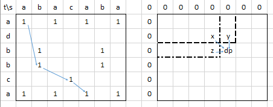
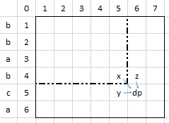
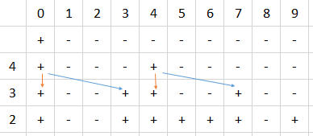

# Динамическое программирование 2D

https://www.youtube.com/watch?v=e67Tba6tC1Y  
https://algorithmica.org/tg/knapsack-gis-gcs

В dp хранятся возможные "состояния нашей системы". И, конечно, оно может описываться не только 2 параметрами: 
2d - не предел. И четырехмерные dp - вполне норм. 
Часто в процессе решения вводим слишком много измерений, а потом уже надо стараться выкинуть лишние.  

Восстановление пути. Обычно массив, где для соответствующего элемента хранится его предок. 
Необязательно хранить две его координаты, например, можно определять направление откуда пришли в эту ячейку. 
Тогда намного проще код может получиться.   

## Наибольшая общая подпоследовательность
Даны две строки, найти максимально длинную подпоследовательность (т.е. не обязательно соседние буквы), 
которая есть в обеих строках  
  
Матрица dp. Окантуем ее нулями слева и сверху, как обычно - так удобнее.   
В ячейке (i, j) храним максимальную длину подпоследовательности, которую можно составить из i букв одной строки 
и j другой. Тогда (см. на рис. y и z):  
```python
dp[i][j] = max(dp[i - 1][j], dp[i][j - 1])
```
Кроме случая, когда буквы, соответствующие i и j совпадают. В этом случае можем заменить (см. на рис. x):  
```python
if s[i - 1] == t[j - 1]: # не забываем, что добавили окантовку в dp  
    dp[i][j] = max(dp[i][j], dp[i - 1][j - 1] + 1)
```
Ответ в правой нижней ячейке  
Восстановление ответа. Еще один массив. Сохраняем в нем с какого направления пришли в данную ячейку: x, y или z. 
Потом будем идти из правого нижнего угла и если пришли из x (dp[i][j] == dp[i - 1][j - 1] + 1), 
то включаем текущую ячейку в ответ, если y или z (dp[i][j] == dp[i - 1][j]), то переходим туда (i--), 
но не добавляем ячейку в ответ.  


## Наибольшая возрастающая последовательность
Дана последовательность arr: 3 1 2 4 6 5 3  

### Решение N^2
Массив dp длиной N+1. dp[i] - длина НВП для первых i чисел. dp[0] = 0.  
dp[i] = max(1, 1 + max(среди dp[k] для которых arr[k] < arr[i])). Поиск max будет за N.  
Ответ - max(dp).  
Восстановление ответа: в массиве родителей для каждого i хранить, где был этот максимум - там и есть предыдущее число. 

### Решение NlogN
Массив dp длиной N+1. dp[i] - минимальное число, на которое заканчивается возрастающая подпоследовательность длины i. 
dp[0] = -бесконечность, остальные - +бесконечность.  
dp пошагово:  
| - + + + + + + +  
| - 3 + + + + + +  
| - 1 + + + + + +  
| - 1 2 + + + + +  
| - 1 2 4 + + + +  
| - 1 2 4 6 + + +  
| - 1 2 4 5 + + +  
| - 1 2 3 5 + + +  
Эдакий "стек", в который мы погружаем маленькие числа.
Начинаем обрабатывать с первого числа. Каждый раз корректируем нужные элементы в dp, находя их бинарным поиском
```c++
for (int x : arr) {
    int pos = lower_band(dp.begin(), dp.end(), x);
    dp[pos] = x;
}
```
Ответом максимальный индекс в dp такой, что значение в нем не +бесконечность.  
Для восстановления ответа можно поддерживать заполнение двух массивов: pos и prev. 
В pos[i] будем хранить индекс элемента, на который заканчивается оптимальная подпоследовательность длины i, 
а в prev[i] - позицию предыдущего элемента для arr[i]. 
Когда в стек погружаем число его индекс записываем в соответствующую позицию pos: pos[j] = i. 
Предыдущим для этого числа является число находящееся в pos левее, его и записываем в prev: prev[i] = pos[j - 1].  
```pseudocode
for i = 0 to n - 1
    j = binary_search(dp, arr[i])
    if (dp[j - 1] < arr[i] and arr[i] < dp[j])
        dp[j] = arr[i]
        pos[j] = i
        prev[i] = pos[j - 1]
        length = max(length, j)
```  
Начинаем с элемента в pos, соответствующего длине нвп. Далее перескакиваем по элементам в prev.    
```pseudocode
p = pos[length]
while p != -1
    answer.push_back(arr[p])
    p = prev[p]
reverse(answer)
```


## Расстояние между строками
Минимальное количество действий, чтобы превратить одну строку в другую (t в s, например). Возможные действия:
- удалить букву;
- вставить букву;
- заменить букву.

  
dp[i][j] - расстояние для префиксов длиной i и j. T + 1 на S + 1, т.к. делаем окантовку. dp[0][0] = 0. 
Ответ в dp[T][S]. Если буквы i и j совпадают, то слова удлинятся на 1, но расстояние между ними не изменится. 
А если не совпадают, то есть 3 варианта действий:  
```псевдокод
if s[i -1] == t[i - 1])  // не забываем, что у нас окантовка
    dp[i][j] = dp[i - 1][j - 1]  // слова удлинились на 1, но расстояние не изменилось
else
    dp[i][j] = min(
            dp[i - 1][j - 1] + 1,  // x, заменить одну букву на другую
            dp[i][j - 1] + 1,  // y, добавить одну букву
            dp[i - 1][j] + 1  // z, убрать одну букву
    )    
}
```

## Определите количество N-значных плавных чисел
Плавное, если значения соседних цифр отличаются не более, чем на 1. 
Запись числа не может начинаться с цифры 0.  
Представляем число в виде массива цифр.  
dp[i, j] - количество чисел длиной i, заканчивающихся цифрой j.  
```псевдокод
инициируем: dp(1, 0) = 0; dp(1, 1...9) = 1
для j = 1..8: dp(i, j) = dp(i-1, j-1) + dp(i-1, j) + dp(i-1, j+1)
dp(i, 0) = dp(i-1, 0) + dp(i-1, 1)
dp(i, 9) = dp(i-1, 9) + dp(i-1, 8)
```


## Рюкзак

Для случая, когда веса предметов - это действительные числа, быстрые полиномиальные решения с динамикой не работают, 
и надо писать перебор.
Похож на задачи, связанные с расписанием?

### Полный рюкзак
Можно ли из заданных грузов собрать рюкзак вместимости X?  
  
w - веса предметов.  
Булевский массив dp. (N + 1) * (W + 1), где N - количество предметов, W - общий вес предметов (наверное, достаточно X?).
Добавляем значения 0. Изначально все - False. dp[0][0] = True - 0 предметов могут дать 0 кг.  
Берем (или не берем) предметы начиная с первого. dp[i][j]. Рюкзак размером j можно заполнить полностью взяв несколько 
из i первых предметов, если мы уже получали вес j даже для i - 1 предмета или получали для i - 1 предмета вес меньше 
ровно на вес i-го предмета. O(X*n).  
```python
for i in range(1, n + 1):
    for j in range(0, W + 1):
        dp[i][j] = dp[i - 1][j]
        if w[i] <= j and dp[i - 1][j - w[i]]:  # первое - чтобы не вылезти за пределы массива?
            dp[i][j] = True
```  
Ответ в dp[N + 1][X] True.  

Модификация. Нам нужна информация только с предыдущей строки матрицы dp, левее текущей ячейки. 
Можно использовать массив длины W + 1, но, чтобы не перезатирались нужные в будущем данные, будем бежать по нему 
справа налево. Бежать дальше, чем вес текущего предмета не нужно: там значения и останутся такие же, 
как в предыдущей строке.  
```c
for (int x : arr) {
    for (int j = W + 1; j >= x; j--) {
        dp[j] = dp[j - x] || dp[j]
    }
}
```

Рюкзак на битсете. Можем не массив булевых значений хранить (по байту на значение?), 
а использовать bitset - по биту на значение. Битсет поддерживает побитовые операции, в т.ч. смещение. 
dp = dp | (dp << w[i])


### Рюкзак со стоимостями
Надо выбрать из n предметов рюкзак с наибольшей суммарной стоимостью, но весом не превосходящим W.  
w - веса предметов, c - их стоимости. В dp[i][j] максимальная суммарная стоимость набора из первых i предметов 
для рюкзака размера j. Изначально весь dp заполнен нулями.  
Ответ - максимальный dp[n][j].  
O(W*n). Тоже возможна модификация с dp размером 1 х (W + 1), с движением справа-налево.  
```python
for i in range(1, n + 1):
    for j in range(0, W + 1):
        dp[i][j] = dp[i - 1][j]
        if w[i] <= j:
            dp[i][j] = max(dp[i][j], dp[i - 1][j - w[i]] + c[i])
```  

Восстановление ответа. Движемся от ячейки с ответом: max(dp[n][j]). Если значение над нами такое же, 
значит эту вещь мы не брали, иначе берем вещь в ответ и смещаемся влево (уменьшаем вес рюкзака = достаем вещь) на w[i].  


### Рюкзак meet in the middle
Задача про полный рюкзак. Огромный рюкзак - 10^18, небольшое количество вещей (N <= 40).  
Решение не динамическое. Делим рюкзак на 2 половины. На одну накладываем все возможные маски - берем/не берем в набор 
и запихиваем в set, unordered_set или массив (который потом отсортируем и бинпоиском работать будем?). 
Теперь те же маски на вторую половину и проверяем каждый получающийся вес на наличие пары в первом контейнере: 
есть ли в нем вес, равный (X - вес справа).  


### Рюкзак с малыми ценами и огромными массами
В динамике можно выбирать, каким "измерением" мы будем описывать систему.  
N < 500, wi < 10^9, ci < 10^5, X < 10^9.
Нельзя создать массив такого размера X. Делаем массив длиной в максимальную стоимость всех вещей, 
заполняем бесконечностями. 
А внутри него храним минимальные массы, которыми можно соответствующую стоимость s набрать среди первых i элементов.  
dp[i] = MIN(dp[s][i - 1], dp[s - c[i]][i - 1] + w[i])  
Ответ - максимальное i, которое не равно бесконечности.


## ДП по поддеревьям

### Максимальное паросочетание
Пусть задано взвешенное дерево. 
Паросочетание - набор ребер графа, такой, что каждой вершине инцидентно не более одного ребра
(т.е. ребра не соединены друг с другом). 
Пусть вес паросочетания - сумма весов, написанных на ребрах. 
Необходимо составить паросочетание максимального веса в этом дереве.  
Чтобы найти паросочетание максимального веса с корнем в вершине i, 
нам необходимо найти максимальное паросочетание для всех поддеревьев i-ой вершины, 
т.е. это типичная динамика.  
w[i][j] - вес ребра из i в j.  
dp[i][0] - максимальный вес паросочетание в поддереве i-й вершины, если мы не взяли ни одно ребро в сыновей i-й вершины; 
dp[i][1] - соответственно, если взяли.  
Тогда, если не взяли ни одно ребро в сыновей, то можем взять любой вес из сыновей 
(в них как могло приходить ребро, так и нет):  
`dp[i][0] = ∑ max(dp[v][0], dp[v][1])`  
, где v - сыновья вершины i, которых мы перебираем.  
Если же берем ребро в сына j, то из него можем взять только вес dp[v][0] и вес ребра из i в j w[i][j], 
а из остальных, ребра в которые мы, соответственно не берем - любой из весов (тот, который больше):  
```
dp[i][1] = 
    max {j ∈ sons(i)} ( 
        dp[j][0] 
        + w[i][j] 
        + ∑ {v ∈ sons(i), v!=j} max(dp[v][0], dp[v][1]) 
    )
```   
Для листьев dp[i][0] = dp[i][1] = 0.  
Реализация через рекурсивный dfs: на выходе из рекурсии для i-ой вершины считаем очередную пару элементов dp[i][0/1].  

### Максимальное подмножество вершин
Требуется выбрать подмножество вершин с максимальной суммой в вершинах a[i], 
чтобы никакие две соседние вершины не лежали одновременно в этом подмножестве.  
dp_in - если берем вершину, dp_out - нет.  
Если включаем вершину v, то ее детей u точно не включаем, а значит можем брать у детей только dp_out: 
dp_in[v] = a[v] + ∑ dp_out[ui], где v - текущая вершина, а u - ее дети.  
Если же v не включаем, то u может быть включен, а может и нет - берем у каждого максимум из dp_in и dp_out:  
dp_out[v] = ∑ max(dp_in[ui], dp_out[ui])  
```python
def dfs(v, parent):
    dp_in[v] = a[v - 1]  # a[0...n-1] -> вершины 1..n
    dp_out[v] = 0

    for u in tree[v]:  # пробегаем по детям
        if u != parent:
            dfs(u, v)
            dp_in[v] += dp_out[u]
            dp_out[v] += max(dp_in[u], dp_out[u])
```


### Число подпалиндромов
https://ru.algorithmica.org/cs/general-dynamic/segments/  
Линейный алгоритм Манакера, конечно, лучше.  
Требуется для данной строки размера n определить, сколько её подстрок являются палиндромами.  
Заведем динамику dp[l,r], равную единице, если подстрока с l по r является палиндромом, и нулем в противном случае.  
База. Подстроки размера 1 всегда палиндромы, подстроки размера 2 - палиндромы, если обе буквы одинаковые. 
Иногда базой для подстрок четного размера берут подстроки размера 0.  
Переход. Строка s является палиндромом, если s0 = sn, а строка s_1…n−1 уже является палиндромом: 
`dp[l, r] = (sl == sr) && dp[l+1, r−1]`.  
Для ответа сможем просто просуммировать все ячейки этой динамики.  
При просчете перехода мы не можем обходить по возрастанию l и r, т.к. нам нужно значение из l+1. 
Один вариант - снаружи итерироваться по длине строки d = (r - l + 1), тогда  dp[l+1, r−1] уже посчитаны же. 
Второй - инициализировать dp единицами, итерироваться по уменьшению l и росту r, начиная с r = l + 1.  


