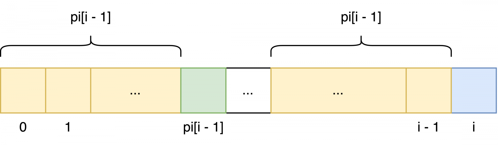
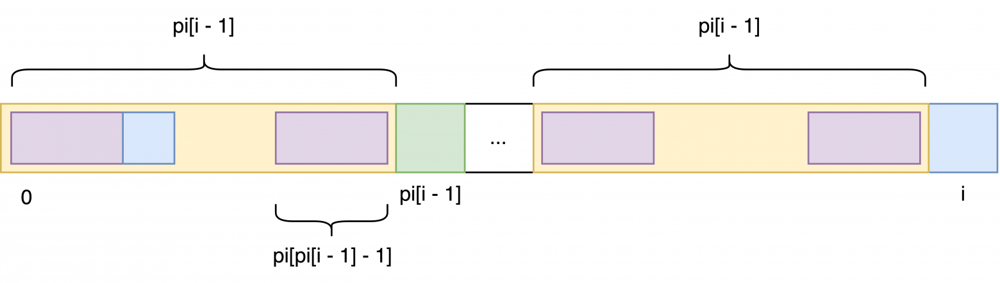
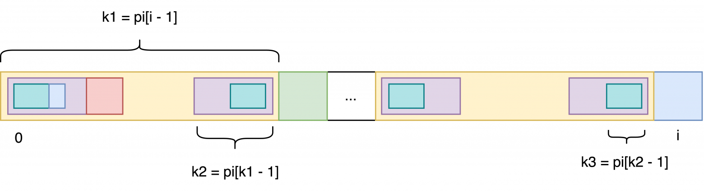

## Префикс-функция
https://habr.com/ru/articles/843376/
Дана строка S длиной n. Префикс-функция - массив чисел pi той же длины n.  
Рассмотрим подстроку, состоящую из i первых элементов строки. 
k - длина наибольшего префикса этой подстроки, который одновременно является суффиксом этой подстроки. 
Т.е. совпадают k первых и k последних букв подстроки. Префикс и суффикс могут пересекаться. 
Но рассматриваются только собственные префиксы, т.е.не рассматривают случай, когда префикс - вся подстрока. 
k и является значением п-ф в позиции i. Для первой позиции п-ф принимают равной pi[0] = 0.  
a b c d a b s c a b c d a b i a  
0 0 0 0 1 2 0 0 1 2 3 4 5 6 0 1  
Наивный алгоритм через три цикла - O(n^3). Но можно за O(n).  
Будем считать динамически: pi[i] по предыдущим значениям pi. 
pi[i] = pi[i - 1] + 1, если следующие буквы совпадают (s[i] == s[pi[i - 1]] (нумерация с 0?)). 
Разница между соседями не может быть больше, чем +1.  

Используется, например в КМП (см.ниже).

## Алгоритм Кнута-Морриса-Пратта
https://www.youtube.com/watch?v=S2I0covkyMc  
КМП. Общие идеи только. Как я понял. Чтобы в будущем разобраться.  
Задача найти вхождение заданной строки s' в некоторую другую строку s. Длины строк - m и n.  
Наивный подход - сравниваем элементы, начиная с первого элемента строки s, потом начиная со второго... O(n * m).  
Почему надо смещаться на 1 элемент, а не на m? Потому что внутри s' могут быть элементы, которые похожи на начало s'. 
Поэтому смещаться надо на величину, учитывающую такие повторы.  
Создаем префикс-функцию - массив, в котором на i-ой позиции максимально возможная длина совпадающих префиксов и 
суффиксов на отрезке s'[0:i].
(Собственных префиксов/суффиксов. То есть не учитываются п и с длиной во всю рассматриваемую строку). 
Кстати, префикс и суффикс могут пересекаться. 
Например, префикс-функция для 'aataataa':  
a  a  t  a  a  t  a  a  
0  1  0  1  2  3  4  5  
Например, для aat нет совпадающих суффиксов и префиксов. Для строки длиной 8, совпадающие префикс и суффикс - 'aataa'.  
Построить префикс-функцию можно наивно за m^3. КМП придумали как это сделать за O(m). Не разобрался в механизме.  
Использование пф для решения задачи описывают по разному.  
Вариант 1. Считаем пф для s' и потом смещаем образец относительно s сразу же не на одну букву, а на столько букв, 
на сколько это позволительно (узнаем это как-то из пф). 
Конечно, в алгоритме нет никаких смещений текстов: ползают два указателя - на s и s'.  
Вариант 2. Конкатенируем s' + какой-то знак отсутствующий в обеих строках + s. Запускаем расчет префикс-функции 
для этой суперстроки. Там где в пф будет стоять значение m заканчивается вхождение s' в эту суперстроку:  
choose#choose life. choose a job.  
000000012345600000001234560000000  
*Алгоритм построения префикс-функции*.  
Я так понял, что основная заслуга КМП как раз в нахождении способа посчитать пф за O(m).  
 |j      |i  
 л и и л л и и л  
Префикс-функция - массив p. p[0] = 0. Изначально j = 0, i = 1.  
Указатель j соответствует длине рассматриваемого в данный момент префикса, указывает на текущий рассматриваемый элемент 
префикса. 
Ползает туда-сюда.  
Указатель i указывает на текущий рассматриваемый элемент суффикса и рассчитываемый элемент префикс-функции. 
Мы его если смещаем, то только на шаг вправо.  
- Тестируем образец длины j, сравнивая s[j] и s[i]. 
  - Если они совпадают — то p[i] = j+1 (нумерация же с нуля) и переходим к следующим индексам i++, j++.  
  - Если же символы отличаются, то уменьшаем длину j: j = p[j-1].
    (Объяснение этого шага, видимо, такое же как в Алгоритме поиска вхождений). 
    Повторяем этот шаг алгоритма с начала. 
- Если так мы доходим до длины j=0 и так и не нашли совпадения, то останавливаем процесс перебора образцов 
  и полагаем p[i] = 0. Переходим к следующему индексу i++ и далее к попыткам нарастить префикс и суффикс "с нуля".  

*Алгоритм поиска вхождений* (вариант 1).  
i          |  
 л и л и л о с ь   л и л и л а с ь  
j          |  
 л и л и л а  
пф:  
 0 0 1 2 3 0  
Указатель i ползет по s, а j - по s'.  
Пока под ними одинаковые буквы смещаем оба указателя вправо на шаг.  
При j=5 - разные буквы. 
Смотрим значение пф[4]. Там число 3. 3 элемента левее ('лил') нынешнего положения указателя j такие же, 
как 3 элемента в начале строки s'. 
Смещаем указатель j на индекс 3. 3 элемента левее него всё те же: 'лил'. 
Это как смещение s' относительно s так, чтобы 'лил' из s' расположился под 'лил' из s.  
Снова сравниваем буквы под указателями i и j. 
И далее по циклу.  
Если буква под i не совпадает с первым символом s', то смещаем i на шаг вправо.  
Нашли, если j == m.  
Удивительно, что обеих частях алгоритма, хотя j ползает туда-сюда, сложность O(n+m).

