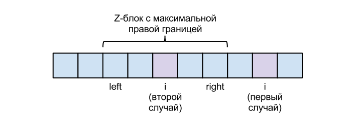
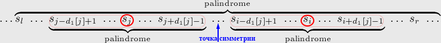
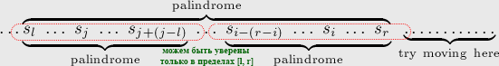

# STRINGS

## Z-функция
Дана строка S длиной n. Z-функция - массив чисел z той же длины n, где 
z[i] равно длине максимальной подстроки, начинающейся с i-й позиции, которая равна префиксу s. 
z[0] = 0.  
a b a c a b a d a b a  
0 0 1 0 3 0 1 0 3 0 1  
Наивный алгоритм через два цикла - O(n^2). Но можно за O(n).  
Будем считать динамически: Z[i] по предыдущим значениям Z. 
Заведём две переменные: left и right - начало и конец z-блока в строке (совпавшего с префиксом суффикса) 
с наибольшим найденным на данный момент значением right. 
Изначально left = right = 0.  
  
1. Если i > right. 
Тупо в лоб пробегаемся по строке S и сравниваем символы на позициях S[i + j] и S[j]
(соответствующие символы в начале строки и начиная с i-ой позиции). 
Пусть S[j] первая позиция, для которой S[i + j] != S[j].
Тогда Z[i] = j, left = i, а right = i + j − 1.  
2. Если i ⩽ right, т.е. текущую позицию мы уже "видели" на предыдущих итерациях. 
Мы можем использовать уже подсчитанные значения зф. 
Вспомним, что подстроки s[left...right] и s[0...(right - left)] совпадают. 
Значит, в качестве начального приближения для z[i] можно взять соответствующее ему значение 
из отрезка s[0...(right - left)] (его альтер эго на префиксе), а именно, значение z[i - left]. 
Однако значение z[i - left] могло оказаться слишком большим: таким, что при применении его к позиции i 
оно "вылезет" за пределы границы r. Этого допустить нельзя, т.к. про символы правее right мы ничего не знаем, 
они пока скрыты от нас "туманом войны". 
Таким образом, в качестве начального приближения для z[i] безопасно брать только такое выражение: 
min(right - i + 1, z[i - left]). 
Дальше действуем тривиальным алгоритмом — 
потому что после границы right может обнаружиться продолжение отрезка совпадения.  
Если я правильно понимаю, если меньше z[i - left] и он оно меньше right, то запускать тривиальный алгоритм и не надо - 
мы уже пробовали (когда изучали префикс) и знаем, что следующий элемент не совпадет. 
Но тогда в код if надо будет добавить, легче пустой шаг сделать.  

Таким образом, весь алгоритм представляет из себя два случая, которые различаются только начальным значением z[i]: 
в первом случае оно полагается равным нулю, а во втором — определяется по формуле. 
После этого обе ветки алгоритма сводятся к выполнению тривиального алгоритма, 
стартующего сразу с указанного начального значения.

```c
vector<int> z_function(string s) {
    int n = (int) s.size();
    vector<int> z(n, 0);
    int l = 0, r = 0;
    for (int i = 1; i < n; i++) {
        // если мы уже изучали этот символ на предыдущих итерациях
        if (i <= r)
            // то мы можем попробовать его инициализировать z[i - l],
            // но не дальше правой границы: там мы уже ничего не знаем
            z[i] = min(r - i + 1, z[i - l]);
        // дальше тривиальный алгоритм от значения строкой выше или от 0
        while (i + z[i] < n && s[z[i]] == s[i + z[i]])
            z[i]++;
        // проверим, правее ли мы текущего z-блока с самым правым r и изменим l и r
        if (i + z[i] - 1 > r) {
            r = i + z[i] - 1;
            l = i;
        }
    }
    return z;
}
```

### Поиск подстроки
Образуем строку s = pattern + # + text, где # — символ, не встречающийся ни в text, ни в pattern. 
Вычисляем Z-функцию (зф) от этой строки. 
В полученном массиве, в позициях, в которых значение зф равно длине pattern, 
начинаются подстроки, совпадающие с pattern.


## Алгоритм Манакера
Найти все палиндромы в строке S.  
Пока рассмотрим нахождение нечетных палиндромов.  
Дана строка S длиной n. 
d - массив чисел той же длины n, где d[i] равно количеству палиндромов с центром в i-й позиции ("радиусу схожести"). 
z[i] = 1 минимум.  
a b a b a b c  
1 2 3 3 2 1 1  
Тривиальный алгоритм (бежим, сличая, в обе стороны от очередного элемента) через два цикла - O(n^2). Но можно за O(n).  
Будем считать динамически: d[i] по предыдущим значениям d. 
Заведём две переменные: left и right - начало и конец подпалиндрома 
с наибольшим найденным на данный момент значением right. 
Изначально left = 0, right = -1.  
У i-го элемента d[i] будет такое же, как у симметричного элемента на отрезке [left...right]: 
симметричность вокруг этого элемента такая же, как вокруг элемента i, т.к. [left...right] - это палиндром. 
Симметричный элемент - это j = left + (right - i).  
  
Но есть нюанс.  
  
Если d[j] выходит влево за пределы отрезка [left...right], то мы можем взять только ту часть, 
которая находится в пределах [left...right], т.к. про символы правее right мы ничего не знаем, 
они пока скрыты от нас "туманом войны". 
Таким образом, в качестве начального приближения для d[i] безопасно брать только такое выражение: 
min (d[left + right - i], r - i + 1). 
Дальше действуем тривиальным алгоритмом, 
потому что после границы right может обнаружиться продолжение радиуса схожести.  
Для четных палиндромов нужно сделать свой алгоритм. 
Но можно схитрить, добавив между каждой буквой исходной строки знак, не встречающийся в тексте: a#b#a#b#a#b#c. 
И запустить на ней только "нечетный" алгоритм. 
Тогда нечетные палиндромы будут с центром на букве, а нечетные, с центром на знаке #.  

## Префикс-функция
https://habr.com/ru/articles/843376/  
Дана строка S длиной n. Префикс-функция - массив чисел pi той же длины n.  
Рассмотрим подстроку, состоящую из i первых элементов строки. 
k - длина наибольшего префикса этой подстроки, который одновременно является суффиксом этой подстроки. 
Т.е. совпадают k первых и k последних букв подстроки. Префикс и суффикс могут пересекаться. 
Но рассматриваются только собственные префиксы, т.е.не рассматривают случай, когда префикс - вся подстрока. 
k и является значением п-ф в позиции i. Для первой позиции п-ф равна pi[0] = 0.  
a b c d a b s c a b c d a b i a  
0 0 0 0 1 2 0 0 1 2 3 4 5 6 0 1  
Наивный алгоритм через три цикла - O(n^3). Но можно за O(n).  
Будем считать динамически: pi[i] по предыдущим значениям pi. 
П-ф онлайновая — достаточно считать следующий символ, и сразу можно узнать значение.  
k = pi[i] = pi[i - 1] + 1, если следующие буквы совпадают (s[i] == s[pi[i - 1]] (нумерация с нуля же)). 
Разница между соседями не может быть больше, чем +1.  
Но что делать, если следующие буквы не совпадают (синяя и зеленая на картинке)?  

(Длина совпадающей на данный момент области (желтой): k = pi[i - 1]). 
Придется взять меньшую область совпадения суффикса и префикса. 
Это крайние левая и правая фиолетовые области на рисунке ниже. 
Но, поскольку желтые области одинаковые, то мы можем пририсовать еще две фиолетовые области.  
  
Как найти максимально возможную фиолетовую область? 
Максимальная фиолетовая область будет равна п-ф от конца второй фиолетовой области: k = pi[k - 1] = pi[pi[i - 1] - 1] 
(п-ф от конца четвертой фиолетовой области, например, будет равна длине желтой области). 
Если синие буквы совпали (s[i] == s[k]), то мы нашли то, что нужно. 
И вычисляем значение п-ф: p[i] = k + 1.  
Если же следующие буквы (синяя и зеленая на картинке снизу) не совпали, 
мы снова пытаемся уменьшить область совпадения суффиксов и префиксов - зеленая область на рисунке ниже. 
  
Какова длина этой зеленой области? 
Мы посмотрим длину второй зеленой области (на рисунке не показана) в рамках первой фиолетовой области. 
А это опять будет k = pi[k - 1].  
И так до тех пор, пока k не станет равным 0.  
Используется, например в КМП-алгоритме (см.ниже).  

```c
vector<int> prefix_function(string s) {
    int n = s.size();
    vector<int> pi(n);
    pi[0] = 0;
    for (int i = 1; i < n; i++) {
        int k = pi[i - 1];
        while (k > 0) {
            if (s[i] == s[k]) {
                k++;
                break;
            }
            k = pi[k - 1];
        }
        if (k == 0 && s[i] == s[0]) {
            k = 1;
        }
        pi[i] = k;
    }
    return pi;
}
```


### Алгоритм Кнута-Морриса-Пратта
https://www.youtube.com/watch?v=S2I0covkyMc  
КМП. Общие идеи только. Как я понял. Чтобы в будущем разобраться. 
Второй вариант алгоритма очевиден, если понял алгоритм построения пф.  
Задача найти вхождение заданной строки s' в некоторую другую строку s. Длины строк - m и n.  
Наивный подход - сравниваем элементы, начиная с первого элемента строки s, потом начиная со второго... O(n * m).  
Почему надо смещаться на 1 элемент, а не на m? Потому что внутри s' могут быть элементы, которые похожи на начало s'. 
Поэтому смещаться надо на величину, учитывающую такие повторы.  
Создаем префикс-функцию - массив, в котором на i-ой позиции максимально возможная длина совпадающих префиксов и 
суффиксов на отрезке s'[0:i].
(Собственных префиксов/суффиксов. То есть не учитываются п и с длиной во всю рассматриваемую строку). 
Кстати, префикс и суффикс могут пересекаться. 
Например, префикс-функция для 'aataataa':  
a  a  t  a  a  t  a  a  
0  1  0  1  2  3  4  5  
Например, для aat нет совпадающих суффиксов и префиксов. Для строки длиной 8, совпадающие префикс и суффикс - 'aataa'.  
Построить префикс-функцию можно наивно за m^3. КМП придумали как это сделать за O(m). Не разобрался в механизме.  
Использование пф для решения задачи описывают по разному.  
Вариант 1. Считаем пф для s' и потом смещаем образец относительно s сразу же не на одну букву, а на столько букв, 
на сколько это позволительно (узнаем это как-то из пф). 
Конечно, в алгоритме нет никаких смещений текстов: ползают два указателя - на s и s'.  
Вариант 2. Конкатенируем s' + какой-то знак отсутствующий в обеих строках + s. Запускаем расчет префикс-функции 
для этой суперстроки. Там где в пф будет стоять значение m заканчивается вхождение s' в эту суперстроку:  
choose#choose life. choose a job.  
000000012345600000001234560000000  
*Алгоритм построения префикс-функции*.  
Я так понял, что основная заслуга КМП как раз в нахождении способа посчитать пф за O(m).  
 |j      |i  
 л и и л л и и л  
Префикс-функция - массив p. p[0] = 0. Изначально j = 0, i = 1.  
Указатель j соответствует длине рассматриваемого в данный момент префикса, указывает на текущий рассматриваемый элемент 
префикса. 
Ползает туда-сюда.  
Указатель i указывает на текущий рассматриваемый элемент суффикса и рассчитываемый элемент префикс-функции. 
Мы его если смещаем, то только на шаг вправо.  
- Тестируем образец длины j, сравнивая s[j] и s[i]. 
  - Если они совпадают — то p[i] = j+1 (нумерация же с нуля) и переходим к следующим индексам i++, j++.  
  - Если же символы отличаются, то уменьшаем длину j: j = p[j-1].
    (Объяснение этого шага, видимо, такое же как в Алгоритме поиска вхождений). 
    Повторяем этот шаг алгоритма с начала. 
- Если так мы доходим до длины j=0 и так и не нашли совпадения, то останавливаем процесс перебора образцов 
  и полагаем p[i] = 0. Переходим к следующему индексу i++ и далее к попыткам нарастить префикс и суффикс "с нуля".  

*Алгоритм поиска вхождений* (вариант 1).  
i          |  
 л и л и л о с ь   л и л и л а с ь  
j          |  
 л и л и л а  
пф:  
 0 0 1 2 3 0  
Указатель i ползет по s, а j - по s'.  
Пока под ними одинаковые буквы смещаем оба указателя вправо на шаг.  
При j=5 - разные буквы. 
Смотрим значение пф[4]. Там число 3. 3 элемента левее ('лил') нынешнего положения указателя j такие же, 
как 3 элемента в начале строки s'. 
Смещаем указатель j на индекс 3. 3 элемента левее него всё те же: 'лил'. 
Это как смещение s' относительно s так, чтобы 'лил' из s' расположился под 'лил' из s.  
Снова сравниваем буквы под указателями i и j. 
И далее по циклу.  
Если буква под i не совпадает с первым символом s', то смещаем i на шаг вправо.  
Нашли, если j == m.  
Удивительно, что обеих частях алгоритма, хотя j ползает туда-сюда, сложность O(n+m).


## Полиномиальное хеширование
https://www.youtube.com/watch?v=bH45DuZjBWw https://ru.algorithmica.org/cs/hashing/polynomial/  
Представляем строку, как последовательность чисел от 1 до m (размер алфавита). 
Поскольку в C++ тип char это на самом деле тоже число можно делать так:  
int x = (int) (c - 'a' + 1);  
Например, задача найти вхождение заданной строки s' в некоторую другую строку s. Длины строк -  m и n.  
Наивный подход - сравниваем элементы, начиная с первого элемента строки s, потом начиная со второго... O(n * m).  
Давайте сравнивать не поэлементно, а хеши сравниваемых строк. 
Очень грубо, чтобы не было коллизий для подстроки длиной n, надо размер хеша иметь много больше n^2. 
Но вычисление хеша тоже будет O(m). 
Постараемся сделать вычисление быстрее для s.  
Алгоритм Рабина-Карпа.  
Прямой полиномиальный хеш: h = (s0 * k^0 + s1 * k^1 + s2 * k^2 + ... + sm-1 * k^(m-1)) % p  
Обратный полиномиальный хеш: h = (s0 * k^(m-1) + s1 * k^(m-2) + s2 * k^(m-3) + ... + sm-1 * k^0) % p  
Лучше считать их в цикле. Для обратного: ((s0 * k + s1) * k + s2) * k + ... 
Для прямого надо в переменной m накапливать степень k (m *= k) и использовать m для добавления следующего члена: 
h = (h + m * s[i]). 
Все время не забываем бороться с переполнением: % p.  
k должен быть больше размера алфавита, p - большое число (чтобы не было коллизий).
Они должны быть взаимно простыми, чтобы деление по модулю можно было делать. 
Можно взять k простое, тогда p проще подобрать взаимно простым. 
Стандарт - k = 57, p = 1e9 + 7.  
Посчитаем хеш h0 первой подстроки строки s (от 0 до m-1). Следующий хеш не будем считать "с нуля", а пересчитаем 
(для обратного): h1 = (h0 * k - s0 * k^m + sm) % p. 
(Для прямого хеша 'нельзя' построить h1? h1 = (h0 - s0) / k + sm * k^m. Но для операции деления не сохраняется 
остаток по делению). 
И тогда в среднем сложность вычисления хешей станет O(1), а всего алгоритма O(m + n), видимо.  
~~Если хеши совпали, то надо перепроверить поэлементно?~~  
Так же по несложным формулам можно пересчитывать хеши при удалении префикса, суффикса, конкатенации строк.  
Предпосчитав хеши всех возможных префиксов (один левый элемент, два левых, три левых...), 
можно вычислять хеш любого подотрезка h(s[l:r]) = (hr - hl) / k^l. 
Но так, вроде, долго. Нам не обязательно же нужен именно полиномиальный хеш - 
можно привести не к нулевой степени, а к достаточно большой n-ой, умножение считать проще: 
h2(s[l:r]) = k^(n - l) * (hr - hl).  
Если в коде часто нужны степени k, надо предподсчитать их, сложив в массиве.  

