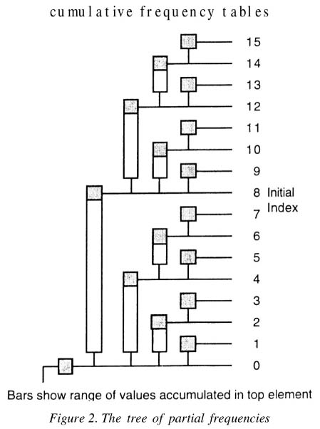
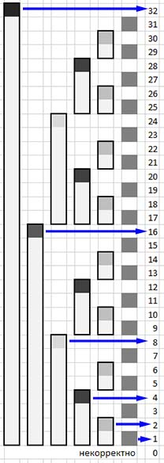

## Система непересекающихся множеств (СНМ)
https://ru.algorithmica.org/cs/set-structures/dsu/  
Умеет отвечать на вопросы типа «находятся ли элементы a и b в одном множестве» и «чему равен размер данного множества». 
Часто используется в графовых алгоритмах для хранения информации о связности компонент.  
Структура должна поддерживать 2 операции:
- Объединить два каких-либо множества;
- Запросить, в каком множестве сейчас находится указанный элемент.  

Изначально у нас n элементов, каждый в своём множестве. 
В каждом множестве должен быть один "лидер". 
По его номеру мы и "называем" множество. 
Создаем массив лидеров: кто является лидером данного элемента. Заполняем его напротив индексов от 1 до n - 1 числами 
от 1 до n - 1 поскольку сейчас каждый элемент сам себе лидер.  
Множества элементов мы будем хранить в виде деревьев, пристегивая при объединении лидера одного множества к лидеру 
другого. 
Но тут надо будет оптимизировать, чтобы деревья не становились слишком глубокими, бамбукообразными.  
Для запроса в каком множестве находится какой-то элемент нужно только подняться по ссылкам до корня.  
Теперь оптимизации.  
Эвристика сжатия пути. При каждом запросе (и второго, и первого) типа все вершины, попавшиеся на пути, 
запоминаем и потом подсоединяем их напрямую к лидеру. 
Простой код, если написать рекурсивно (после рекурсивного вызова переподсоединение делать), 
но можно и список пройденных вершин копить и потом вершины из него переподсоединить к лидеру. 
Чем больше запросов второго типа обработано, тем быстрее будут обрабатываться последующие.  
Ранговая эвристика. Менее глубокое дерево подвешиваем к более глубокому - максимальная глубина не вырастет. 
Надо вести массив рангов лидеров.  
Весовая эвристика. Меньшее по количеству элементов дерево подвешиваем к большему. Надо вести массив весов для лидеров. 
Часто в задачах про графы надо отвечать на вопросы про размер компонент связности и тогда такая эвристика удобна.  
При использовании одной из эвристик сложность будет O(log n). 
Но при использовании эвристики сжатия плюс весовой или ранговой, асимптотика будет уже O(a(n)), 
где a(n) — обратная функция Аккермана (для всех адекватных для олимпиад чисел не превосходящая 4).

## Дерево отрезков
http://e-maxx.ru/algo/segment_tree  
«ДО снизу». Можно делать все операции итеративно — так получится раз в 7 быстрее, 
но писать что-либо нетривиальное (например, массовые операции) так будет намного труднее.  
Например, дан массив чисел и надо для них находить минимум: 
стопицот запросов типа - минимум с 12 по 37-й элемент [l, r].
Строим дерево "от этого массива": сперва минимумы для пар соседних элементов, 
потом слой с минимумами пар пар (т.е. для четверок элементов). 
Потом для восьмерок. И так до общего минимума.  
Надо создать несколько функций: 
- для создания дерева (build); 
- для добавления в массив новых элементов (update; если такое поведение в задаче есть); 
- для извлечения ответа (get; например, ответ на отрезке l-r).  

Все функции рекурсивные.  
Дерево храним в массиве. Если длина исходного массива - 2^k, то длина массива дерева - 2^(k+1). 
Но если такая длина не гарантируется, то с запасом можно выделить 4n ячеек. 
Пусть корень дерева - ячейка 1 (нулевая ячейка не задействуется). 
Адреса детей ячейки m - это 2m и 2m+1, родителя - m // 2.  
_Функция build_. Строим дерево рекурсивно. Начинаем с вершинки, потом идем в ее детей (2*m и 2*m+1, при этом диапазон, 
за который отвечает узел, располовинивается) и т.д. Когда доходим до листа (диапазон становится в 1 элемент), 
ставим значение из исходных данных. На обратном ходе рекурсии вычисляем значения в узлах.  
_Функция get_. Ответ ищем рекурсивно. Узел отвечает за элементы исходного массива [L, R]. Если [l, r] и [L, R] 
не пересекаются, то возвращаем плюс бесконечность (для задачи поиска минимума). [L, R] внутри [l, r] - значение из узла. 
Во всех остальных случаях делим отрезок пополам и вызываем рекурсивно функцию для этих подотрезков. 
Из возвращенных чисел делается ответ на обратном ходу рекурсии.  
_Функция update_. Движемся рекурсивно по узлам в сторону листа изменения значения. На обратном ходе пересчитываем 
значения в родительских узлах.  
Технически легче писать полуинтервалами, а не отрезками: не надо будет в индексах где-то +-1 добавлять. 
mid = (l + r) / 2; [l, mid) и [mid, r).  
Огромное [разнообразие задач](http://www.e-maxx-ru.1gb.ru/algo/segment_tree), 
часто встречается на олимпиадах, в т.ч. как вспомогательный инструмент?  
Обобщается на многомерный случай. Сначала разбиваем по первым индексам, а для каждого отрезка по первым индексам 
строим дерево отрезков по вторым индексам: вкладывание деревьев отрезков друг в друга.

### Дерево отрезков с операцией на отрезке
Дан массив чисел. Тысячи операций двух типов:
- добавить одно и то же число ко всем элементам от a до b;
- вывести текущее значение k-го числа.

Легко решается разностным массивом: первая операция за O(1), вторая - за O(n).  
Дерево отрезков, построенное на разностном массиве делает первую операцию за log(n), но и вторую то же за log(n).  
В дереве поддерживаем сумму элементов. При запросе второго типа выводим сумму с 1 по k.


### Несогласованные поддеревья и массовое обновление
lazy propagation - ленивое распространение. Очень важно научиться его писать — она часто встречается на олимпиадах.  
Идея «давайте будем всё делать в последний момент» применима не только в ДО, 
но и в других структурах ~~и в реальной жизни~~.  
Задача присвоения значения не отрезке и расчета суммы на отрезке. 
При запросе присваивания на отрезке будем помечать некоторые вершины, 
что они и все их дети «покрашены» в какое-то число - имеют несогласованную модификацию. 
Непосредственно спускаться до листьев без необходимости мы не будем. 
Несогласованности будем хранить в отдельном массиве с тем же размером, что и дерево.  
Когда нам позже понадобятся правильные значения таких вершин и их детей, 
мы будем делать «проталкивание» несогласованности из текущей вершины в её сыновей: 
если несогласованность есть, пересчитаем сумму текущего отрезка и передадим несогласованность сыновьям, 
а несогласованность материнской ячейки занулим. 
Теперь материнская вершина согласована, а ее сыновья - нет. 
Мы протолкнули несогласованность/модификацию. 
Когда нам потом понадобятся их сыновья, мы будем делать то же самое.  
При реализации создадим вспомогательную функцию push, 
которая будет производить проталкивание информации из этой вершины в обоих её сыновей. 
Вызывать её стоит перед каждым спуском в сыновей.  
В другом варианте кода, сумму в узле пересчитывали сразу как несогласованность для этого узла изменяли. 
Важно пропушить при переходе в детей, когда считать сумму в узле не важно?  
Какие функции кроме sum можно так обрабатывать? Те, которые обладают коммутативностью ( f(x, y) = f(y, x) ) ?  
При поиске максимума и замене на k всех чисел на отрезке, которые меньше k, нам даже не обязательно проталкивать. 
Инициализируем все вершинки дерева -inf 
и потом записываем в них максимальные значения, выбирая между k и тем, что уже хранится в вершинке. 
При get(k) идем от вершины k вверх по родителям и ищем максимальное число.  

### ДО на указателях
https://ru.algorithmica.org/cs/segment-tree/pointers/  
Не самое быстрое и компактно. Но полезно в некоторых приложениях.  
Каждая вершина дерева отрезков будет структурой, которая содержит: 
- ссылки на детей (т.е. на другую структуру); 
- свои границы [l, r) (можно их и не хранить, а рассчитывать каждый раз); 
- дополнительную нужную для задачи информацию, например, сумму на отрезке.

Строить дерево отрезков можно рекурсивным конструктором, который создает детей, пока не доходит до листьев. 
Если изначально массив не нулевой, то можно параллельно с проведением ссылок насчитывать суммы. 
Изменения и вычисления сумм тоже рекурсивно.  
Можно как-то избавиться от ссылок вообще, если ввести однозначную нумерацию вершин 
и расположить их в таком порядке на массиве.  

### Отложенное построение
https://ru.algorithmica.org/cs/segment-tree/lazy-initialization/  
ДО, но объектов у нас до 10^9, а то и 10^18. log(2)10^18 ~ 60. Норм. Проблема только в построении.  
Изначально создадим только лишь корень, а остальные вершины будем создавать на ходу (эдакое lazy initialization). 
Используем дерево на указателях.  
Будем в начале всех методов будем проверять, что дети-вершины созданы, и создавать их, если это не так. 
При использовании индексаций можно хранить вершины не в массиве, а в хеш-таблице: 
запросы станут работать дольше, но не асимптотически. 
На каждый запрос потребуется O(logn) дополнительной памяти для создания новых вершин, 
что обычно приводит к асимптотике O(qlogn) по памяти.  
Если все запросы известны заранее, то их координаты можно просто сжать перед обработкой запросов.  
В большинстве случаев, использовать динамическое построение — это как стрелять из пушки по воробьям. 
Попробуйте сначала более простые методы: возможно, всё просто в set влезает.  

## Алгоритм Фенвика
https://ru.algorithmica.org/cs/range-queries/fenwick/  
Очень короткий и эффективный алгоритм.  
Дерево Фенвика или двоичное индексированное дерево (англ. binary indexed tree) — 
структура данных, которая на многих задачах заменяет собой дерево отрезков, но при этом работает в 3-4 раза быстрее, 
занимает минимально возможное количество памяти (столько же, сколько и массив той же длины), 
намного быстрее пишется и легче обобщается на большие размерности. 
Опубликовано Фенвиком в 1994.  
Позволяет вычислять значение некоторой обратимой операции на любом отрезке \[L; R] за время O (log N). 
Позволяет изменять значение любого элемента за O (log N).  
Обратимые операции - сумма, произведение, xor. Необратимые - минимум/максимум, gsd в общем случае не сработает.  
 
  
В элементах дерева Фенвика T хранятся суммы части ячеек левее (ниже на рисунке) или значение ai ее самой: 
Ti = sum(j от Fi до i) aj, где F - некая функция, которая определяет "рисунок" заполнения ячеек суммами. 
Легче увидеть идею на рисунке, чем описать словами :)  
Самая популярная функция: x & (x + 1). На левом рисунке. 
Алгоритмика любит x - (x & -x) + 1, считая его более простым для запоминания и кодинга, 
а так же более гибким — например, там можно делать бинпоиск по префиксным суммам. 
На правом рисунке. Рисунок заполнения идентичен.  
Оказывается, можно производить бинарный поиск (точнее, спуск) по префиксным суммам за O(logn). 
В индексации алгоритмики, в «традиционной» индексации такое делать нельзя.  
"k-мерное дерево Фенвика пишется в (k+1) строчку" :). 
Нужно добавить всего одну такую же строчку в sum, add (внешний цикл), 
а также при подсчете суммы на прямоугольнике вместо двух запросов к префиксным суммам использовать четыре.

## Корневая эвристика
Корневые эвристики (Sqrt-декомпозиция) — это обобщённое название различных методов и структур данных, 
опирающихся на тот факт, что если мы разделим какое-то множество из n элементов на блоки по sqrt(n) элементов, 
то самих этих блоков будет не более sqrt(n).  
Медленнее, чем дерево отрезков. Зато проще писать. И можно более сложные вещи накрутить, чем позволят ДО.  
https://neerc.ifmo.ru/wiki/index.php?title=Статистики_на_отрезках._Корневая_эвристика  
https://algorithmica.org/ru/sqrt  
http://www.e-maxx-ru.1gb.ru/algo/sqrt_decomposition  

### Корневая декомпозиция на массивах
Задача нахождения суммы/макс/мин на отрезке [l...r] массива A.  
Предподсчет - построение массива B ( O(n) ):
- Разделим массив на ~sqrt(n) блоков длины ~sqrt(n). 
- В каждом блоке заранее посчитаем необходимую операцию. 
- Запишем результаты в массив длиной ~sqrt(n).  

Запрос на выполнение операции на отрезке [l,r]. Могут быть 2 крайних блока, входящих частично 
и несколько центральных, входящих полностью. Крайние считаем тривиально, значения для центральных  смотрим в масиве B. 
O(sqrt(n)).  
Запрос на изменение элемента. Реализация данного запроса будет зависеть от того, имеет ли операция, 
для которой сделано построение, обратную операцию и обладает ли она свойством коммутативности:
- если оба условия выполняются, то запрос на изменение элемента можно сделать за O(1)
  (меняем сам элемент и его родителя в массиве B);
- если хотя бы одно из условий не выполняется, то запрос на изменение элемента можно сделать за O(sqrt(n)).

Если изменяется не один элемент, а элементы на каком-то отрезке, то можно, видимо, устроить lazy propagation: 
если ко всем элементам блока надо прибавить какое-то число, то сохраняем его в отдельном массиве 
C (длиной тоже ~sqrt(n)). 
Числа из блокового массива C используем при ответах на запросы на выполнение операции.

### Корневая эвристика на запросах
Нам даются некоторые входные данные, а затем поступают q запросов на изменение или подсчет. 
Разобьём входные запросы на блоки длиной sqrt(q). 
В начале обработки каждого блока будем строить структуру данных для "оффлайнового" варианта задачи 
по состоянию данных на момент начала этого блока (для суммы на отрезке - массив префиксных сумм).  
Если первые запросы на ответ - даем их. Если потом приходят запросы на изменение - пропускаем их. 
А когда придет запрос на ответ, посчитаем ответ на исходном массиве, 
а потом пробежимся по всем пропущенным запросам на изменение и применим те из них, 
что затрагивают используемые для данного ответа ячейки.  
После блока запросов sqrt(n) перестраиваем массив с учетом поступивших запросов на изменение
(через разностный массив, конечно).  
O(n∙sqrt(n) + q∙sqrt(n)).  

### СНМ с удалением ребер
Обычная для СНМ задача, но кроме добавления ребер есть и их удаление.  
Строим граф на начало текущего блока сразу же не включая в него те ребра, 
которые в течение этого блока будут удаляться. Строим СНМ.  
Дальше не понял. На каждый запрос добавления надо к исходному СНМ добавлять ребро? 
На каждый запрос ответа добавлять все ребра удаляемые правее? Как это делать? На копии СНМ?  


## Алгоритм Мо
https://ru.algorithmica.org/cs/decomposition/mo/  
https://neerc.ifmo.ru/wiki/index.php?title=Алгоритм_Мо  
Алгоритм Мо применяется для решения задач, в которых требуется отвечать на запросы на массиве без изменения элементов 
в оффлайн.  
Позволяет отвечать на запросы, на которые ДО, например, отвечать не умеет. 
Примеры задач на этот алгоритм: нахождение моды, количество разных чисел, вычисление количества инверсий на отрезке.  
Входной массив делится на блоки фиксированного размера sqrt(N). 
Затем запросы сортируются в соответствии с индексом блока, к которому они принадлежат. 
Если корневая эвристика по запросам группирует запросы по временным признакам, то алгоритм Мо — по пространственным. 
Используется метод двух указателей.  
Сгруппируем все запросы в блоки размера c ≈ sqrt(n) по их левой границе и внутри каждого блока отсортируем запросы 
по правой границе. 

## Двоичное дерево поиска
https://ru.algorithmica.org/cs/tree-structures/  
https://neerc.ifmo.ru/wiki/index.php?title=Дерево_поиска,_наивная_реализация   
Бинарное дерево поиска (англ. binary search tree, BST).  
Сами по себе в олимпиадах используются редко?  
У каждой вершины не более двух детей. Все вершины обладают ключами, на которых определена операция сравнения 
(например, целые числа или строки). У всех вершин левого поддерева вершины v ключи не больше, чем ключ v. 
У всех вершин правого поддерева вершины v ключи больше, чем ключ v. 
Оба поддерева — левое и правое — являются двоичными деревьями поиска. 
Можно по-разному построить на одном и том же множестве элементов.  
Более общим понятием являются обычные (не бинарные) деревья поиска — в них количество детей может быть больше двух, 
и при этом в «более левых» поддеревьях ключи должны быть меньше, чем «более правых».  
Основное преимущество бинарных деревьев поиска в том, что в них можно легко производить поиск элементов. 
Основные функции (поиск, вставка, удаление) работают в худшем случае (бамбук) за O(n). 
При обычном построении дерево получается в той или иной степени бамбучным. 
Поэтому в эффективных реализациях поддерживаются некоторые инварианты, гарантирующую среднюю глубину вершины O(logn). 
Такие деревья называются сбалансированными.  
Деревья чаще всего представляются в памяти как динамически создаваемые структуры с явными указателями на своих детей, 
либо как элементы массива связанные отношениями, неявно определёнными их позициями в массиве. 
Чаще всего бинарные деревья поиска хранят в виде структур — по одной на каждую вершину — в которых записаны ссылки 
(возможно, пустые) на правого и левого сына, ключ и, возможно, какие-то дополнительные данные. 
struct Node {int x; Node *l, *r;};  

### Декартово дерево
https://algorithmica.org/ru/treap  
http://www.e-maxx-ru.1gb.ru/algo/treap  
https://neerc.ifmo.ru/wiki/index.php?title=Декартово_дерево  
Предложены в 1996г (1989?).  
Декартово дерево объединяет в себе бинарное дерево поиска и бинарную кучу (кто-то говорил, что это неправда). 
И похожа на пирамиду. Отсюда куча названий: ДеРамида, КуРево, ПиВо, TreAp. 
ДД является двоичным деревом поиска по x и пирамидой по y.  
Строится так. На плоскости точки. x - ключ, y - приоритет. 
Берем самую верхнюю точку (любую, если их несколько) в качестве корня.
Для всех вершин с меньшим x, чем у корня, рекурсивно запускаем процесс. 
Корень левой части присоединяем к общему корню. 
То же делаем для правой части.  
Если все x и y различны, то дерево строится однозначно. 
В худшем варианте получится бамбук. Поэтому это рандомизированное дерево поиска.  
x - это величины, которые мы храним, а y - это рандомная величина, 
благодаря которой мы и получим балансировку дерева: O(log n) 
(и которая позволяет однозначно строить бинарное дерево поиска ?).  
Как и двоичное дерево поиска позволяет отвечать на запросы: добавить число во множество, есть ли число во множестве, 
lower_bound, количество чисел в промежутке \[l, r]. За O(log n).  
Декартово дерево удобно писать на указателях и структурах.  
```c
struct Node {
    int key, prior;
    Node *l = 0, *r = 0;
    Node (int _key) { key = _key, prior = rand(); }
};
```
l == 0 - нет левого сына, r == 0 - правого.
Надо много функций: insert, erase... Они реализуются через две вспомогательные функции: split и merge.
Split (T, X) - разделяет дерево T на два дерева L и R (которые являются возвращаемым значением) таким образом, 
что L содержит все элементы, меньшие по ключу X, а R содержит все элементы, большие (и равные?) X. 
Очевидная рекурсия: сплитим левое или правое поддерево корня O (log N).  
Merge (T1, T2) - объединяет два поддерева T1 и T2, и возвращает это новое дерево. 
O (log N). Каждое значение в первом меньше значений во втором. 
Выбираем в качестве корня то дерево, у которого приоритет Y в корне больше. Например, это левое дерево L. 
Левое поддерево войдет в итоговое дерево полностью. А правое неизвестно. 
Рекурсивно вызываем merge уже для пары: правое поддерево дерева L и дерево R.  
Insert (X, Y). Сначала спускаемся по дереву, но останавливаемся на первом элементе, в котором значение приоритета 
оказалось меньше Y. Теперь вызываем Split (X) от найденного элемента (от элемента вместе со всем его поддеревом), 
и возвращаемые ею L и R записываем в качестве левого и правого сына добавляемого элемента.  
Erase (X). Спускаемся по дереву, ища удаляемый элемент. Найдя элемент, мы просто вызываем Merge от его левого и 
правого сыновей, и возвращаемое ею значение ставим на место удаляемого элемента.  
Операцию Build реализуем за O (N log N) просто с помощью последовательных вызовов Insert.  
Далее почти не разбирал - скопировал с e-maxx.  
Union (T1, T2). Теоретически её асимптотика O (M log (N/M)), однако на практике она работает 
очень хорошо. Пусть, не теряя общности, T1->Y > T2->Y, т.е. корень T1 будет корнем результата. 
Чтобы получить результат, нам нужно объединить деревья T1->L, T1->R и T2 в два таких дерева, 
чтобы их можно было сделать сыновьями T1. Для этого вызовем Split (T2, T1->X), тем самым мы разобьём T2 
на две половинки L и R, которые затем рекурсивно объединим с сыновьями T1: Union (T1->L, L) и Union (T1->R, R), 
тем самым мы построим левое и правое поддеревья результата. 
В ноде можно хранить не только ссылки на детей, но и другую информацию. 
Например, сумму в поддереве. 
Что позволит отвечать на вопрос о сумме на отрезке. 
Только надо аккуратно прописать изменение значений при сплите и мёрже. 
Написать вспомогательную функцию, которую будем вызывать после каждого структурного изменения вершины.  
в реальной жизни важна фактическая память, занимаемая деревом, а декартово дерево славится своим overhead`ом. 
N на информацию, N на приоритеты, 2N на ссылки на потомков, для неявного дд N на размеры поддеревьев — 
это прожиточный минимум, а если добавить еще и множественные запросы, то получим еще N на каждую операцию.  
Дд позволяет реализовывать очень хитрые вещи.  

#### Неявное декартово дерево
http://www.e-maxx-ru.1gb.ru/algo/treap  
https://habr.com/ru/articles/102364/  
https://algorithmica.org/ru/treap  
Разобраться с этой идеей.  
Дает нам некий усовершенствованный и мощный массив с дополнительными фичами.    
Можно воспринимать как дд, в котором ключи есть, но нам их не сообщили. 
Но клянутся, что условие двоичного дерева поиска выполняется. 
Тогда можно представить, что эти неизвестные иксы суть числа от 0 до N-1.
Это и делает ндд похожим на массив: это же индексы. 
Эти индексы явно хранить мы не будем. Можем хранить размеры поддеревьев каждой вершины. 
Индекс - количество элементов в левом поддереве вершины? 
Из этого индексы восстанавливаются однозначно.  
Например, как слить два массива на ндд? Используем стандартный merge. 
Это же не противоречит правилу: все ключи в левом поддереве должны быть меньше каждого ключа в правом. 
Раз ключей у нас вовсе нет.  
Со split сложнее. Раньше мы резали по ключу. А теперь по индексу, т.е. отрезаем первые сколько-то элементов.  
Теперь в этот массив можем вставлять, удалять элементы, делать множественные запросы и операции на отрезке. 
Можно делать переворот отрезка, циклический сдвиг массива. И все(?) это за O(log N).
Вроде, опять же используется lazy propagation.  
